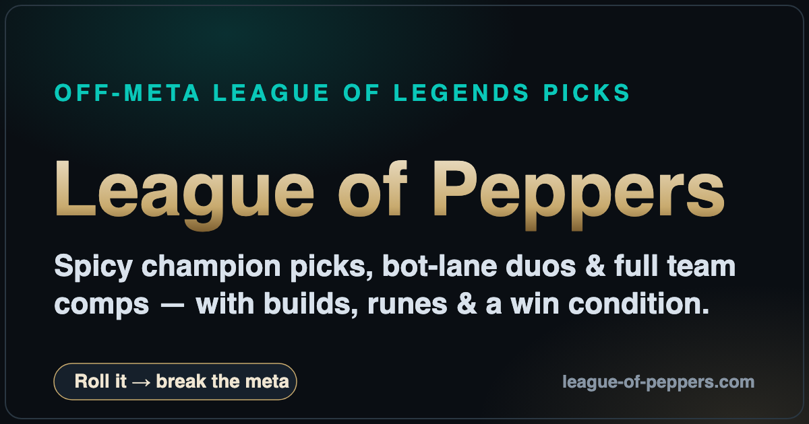

# 🌶️ League of Peppers

**A free League of Legends champion pick generator for players who are bored of the meta.**

### 👉 [**league-of-peppers.com**](https://league-of-peppers.com)



Hit a button and get an instant recommendation — an off-meta (*"spicy"*) or classic
solo pick, a synergized bot-lane duo, or a full five-champion team comp. Every roll
comes with a suggested item build, a rune page, a skill-max order, and a clear **win
condition**, so you know not just *what* to pick but *how* to play it.

---

## What it does

| Mode | What you get |
|------|--------------|
| 🎲 **Solo Pick** | 150+ curated picks, 15+ per role, in two flavors: **Classic meta** and **🌶️ Spicy (off-meta)** — each with a build, runes, and skill order. |
| 👯 **Bot Lane Duo** | Synergized ADC + support pairs (classic and off-meta) with the reason the lane works. |
| 🏆 **Full Comp** | 15 complete team comps with an overview, power spike, win condition, how-to-play steps, and what counters them. |
| 🧠 **Team Analyzer** | Pick five champions and get an archetype, damage profile, and a game plan. |
| ⚔️ **Draft** | A tournament-draft board with pick/ban suggestions. |

Plus: lock-and-reroll, shareable roll links, a recent-rolls history, and full item/rune
tooltips on hover.

## How the data works

There are **two layers**:

- **Live data** — champion art, items, and runes come straight from Riot's
  [Data Dragon](https://developer.riotgames.com/docs/lol), so builds always reflect the
  **current patch** with zero manual updates.
- **Curated data** — which picks are spicy, which duos synergize, what to build, and why
  all live hand-written in [`data.js`](./data.js). That judgment is the moat.

An on-load validator checks every curated champion id, item name, and rune against the
live Data Dragon data and logs any drift to the browser console — so when a patch renames
an item, you know immediately. See [`MAINTENANCE.md`](./MAINTENANCE.md) for the full
data-editing guide.

## Tech

Pure static site — **no framework, no build step, no backend.** Just vanilla HTML, CSS,
and JavaScript that fetches from Data Dragon at runtime.

```
index.html      Markup + SEO metadata (Open Graph, Twitter, JSON-LD)
styles.css      All styling (dark/gold League theme)
app.js          App logic: rendering, modes, validator, tooltips
data.js         The hand-curated dataset (picks, duos, comps, builds, runes)
picks.html      Static, crawlable reference of every pick (for SEO / AI engines)
llms.txt        LLM-friendly site summary
robots.txt      Crawler policy (search + AI bots welcome)
sitemap.xml     Sitemap
indexnow-ping.sh  Ops helper: notify Bing/IndexNow to re-crawl after updates
```

## Running locally

It's a static site, so just serve the folder with anything:

```bash
# Python
python3 -m http.server 8000
# or Node
npx serve .
```

Then open <http://localhost:8000>. (An internet connection is required — the app fetches
champion and item data live from Data Dragon.)

## Disclaimer

League of Peppers isn't endorsed by Riot Games and doesn't reflect the views or opinions
of Riot Games or anyone officially involved in producing or managing Riot Games
properties. League of Legends and Riot Games are trademarks or registered trademarks of
Riot Games, Inc. League of Legends © Riot Games, Inc.
